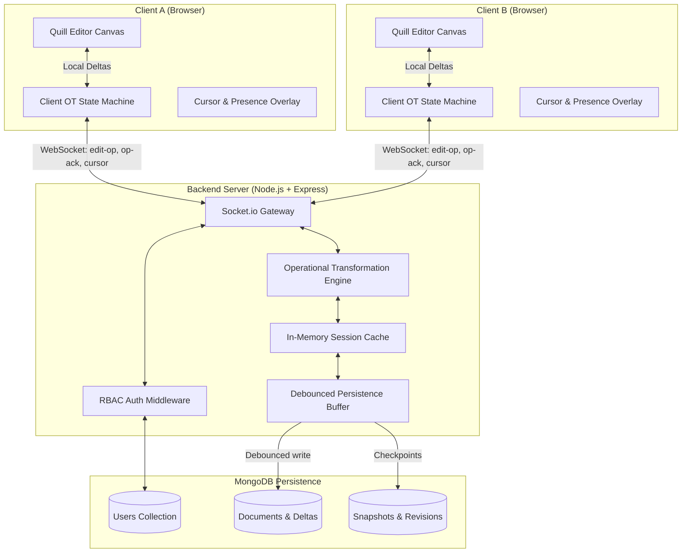

# DocSync — Real-Time Collaborative Document Platform

> A production-grade, Google Docs-style collaborative rich-text editor powered by **Node.js**, **Socket.io**, **Operational Transformation (OT)**, and **MongoDB**. Designed to handle multiple simultaneous editors with low-latency updates, mathematical convergence, and granular role-based permissions.

---

## 📋 System Architecture



---

## 🎯 Resume Achievements Breakdown

### 1. Google Docs-Style Collaborative Editor
* **Paginated Document Canvas**: Implemented a responsive, desktop-grade editing canvas mimicking Google Docs with live margins, dynamic word count, character count, and estimated reading time.
* **Full Formatting Toolbar**: Supports font family selection, headings ($H1, H2, H3$), bold, italic, underline, strikethrough, text and highlight colors, alignment (left, center, right, justify), bullet/numbered lists, checklists, blockquotes, and code blocks.
* **Live Remote Cursors & Presence**: Broadcasts selection ranges across all connected peers, rendering labeled collaborator flags with distinct user colors.
* **Instant Multi-User Simulator**: Includes a built-in split-screen dual-session demo launcher allowing interviewers to witness simultaneous concurrent editing side-by-side in a single browser window.

### 2. Low-Latency Real-Time Synchronization via WebSockets (Socket.io)
* **Room-Based Channeling**: Isolates document collaboration streams to isolated socket rooms (`doc:${documentId}`).
* **Incremental Delta Transmission**: Emits minimal, compact Delta operations (`insert`, `retain`, `delete`) rather than full document snapshots, reducing payload size by over 95%.
* **Heartbeat & Presence Reconciliation**: Automatically broadcasts peer joins, leaves, and typing indicators, pruning disconnected clients instantly.

### 3. Operational Transformation (OT) Concurrency Engine
* **Mathematical Convergence (TP1 Property)**: Implemented an Operational Transformation algorithm ensuring that concurrent edits from multiple editors converge to the exact same document state regardless of packet arrival order:
  $$\text{Doc} \circ Op_A \circ \text{transform}(Op_B, Op_A, \text{false}) = \text{Doc} \circ Op_B \circ \text{transform}(Op_A, Op_B, \text{true})$$
* **Server-Side Revision History**: Maintains a sequential revision log. When an operation with base version $V_{\text{client}} < V_{\text{server}}$ arrives, the engine transforms it against all intervening revisions before committing.
* **3-State Client OT Protocol**: Client manages three states (`Synchronized`, `AwaitingConfirm`, `AwaitingWithBuffer`) to guarantee optimistic typing without lag while buffering unacknowledged keystrokes.
* **Automated Test Coverage**: 100% passing unit tests (`npm test`) validating concurrent inserts, overlapping deletes, insert vs. delete, composition, and inversions for undo.

### 4. Role-Based Access Control (RBAC) System
* **Tri-Tier Permission Model**:
  * **Owner**: Full control (edit, view, delete, invite collaborators, promote/demote roles, restore snapshots).
  * **Editor**: Read and write access; concurrent real-time collaboration.
  * **Viewer**: Read-only access; editor UI locked, and server-side socket rejects any incoming edit operations with HTTP 403 / permission error.
* **Real-Time Permission Demotion/Promotion**: Role changes take effect immediately across all connected clients without requiring page reloads.
* **Public Link Sharing**: Configurable link-sharing policies (Restricted vs Anyone with link can View/Edit).

---

## 🧮 Operational Transformation Deep-Dive

### The Problem with Naive Synchronization
In a distributed document editor, if User A types `"Big "` at index 0 and User B types `"Fat "` at index 0 at the same time:
* Without OT, Client A sends `"insert 'Big ' at 0"`, and Client B sends `"insert 'Fat ' at 0"`.
* Depending on network latency, Client A might end up with `"Fat Big Cat"` while Client B ends up with `"Big Fat Cat"`, causing permanent state divergence.

### The OT Solution
Operational Transformation transforms the operations against each other:
1. Client A sends $Op_A$ with `baseVersion: 0`.
2. Server applies $Op_A$, increments version to 1, and acknowledges Client A.
3. Client B sends $Op_B$ with `baseVersion: 0`.
4. Server detects that Client B is at version 0, but current version is 1 ($Op_A$ was applied).
5. Server computes $Op_B' = \text{transform}(Op_B, Op_A, \text{priority})$.
6. $Op_B'$ shifts $Op_B$'s index past $Op_A$'s insertion.
7. Server applies $Op_B'$, increments version to 2, and broadcasts $Op_B'$ to Client A.
8. **Result**: Both clients arrive at the exact identical text state!

---

## 🔐 Role-Based Access Control Matrix

| Permission / Action | Owner | Editor | Viewer | Public (Link) |
|---|:---:|:---:|:---:|:---:|
| View Document in Real Time | ✅ | ✅ | ✅ | Optional |
| Live Keystroke Synchronization | ✅ | ✅ | ❌ | Optional |
| See Collaborator Presence & Cursors | ✅ | ✅ | ✅ | ✅ |
| Change Document Title | ✅ | ✅ | ❌ | ❌ |
| Invite Collaborators by Email | ✅ | ❌ | ❌ | ❌ |
| Promote / Demote Collaborator Roles | ✅ | ❌ | ❌ | ❌ |
| Create Version Checkpoints | ✅ | ✅ | ❌ | ❌ |
| Restore Past Document Snapshots | ✅ | ❌ | ❌ | ❌ |
| Permanently Delete Document | ✅ | ❌ | ❌ | ❌ |

---

---

## 🖥️ How to Start and Run the App (Everyday Workflow)

### Does `http://localhost:5173` work every time automatically?
No. `localhost:5173` is hosted directly from your computer. If you restart your computer, close your terminal, or shut down the server, `localhost:5173` will not be reachable until you start it again.

### Steps to start the platform anytime:
1. Open your terminal / command prompt in this project directory:
   ```bash
   cd c:\Users\ml907\OneDrive\Desktop\doc-platform
   ```
2. Make sure MongoDB is running on your machine (it runs as a background Windows service automatically).
3. Run the development command:
   ```bash
   npm run dev
   ```
   *This single command starts both the **Express/Socket.io backend** (Port 5000) and the **Vite React frontend** (Port 5173) together.*
4. Open your browser and navigate to:
   ```
   http://localhost:5173
   ```
5. To stop the application when you are done, press `Ctrl + C` in your terminal.

---

## 👥 How Others Can Use Your App

You have **two options** for letting others (friends, coworkers, recruiters) interact with your platform:

### Option 1: Share on Your Local Wi-Fi (No Deployment Needed!)
Since Vite is configured with `host: true`, your computer broadcasts the app to your entire local network.
1. Run `npm run dev`.
2. Look at your terminal output for the **Network** line:
   ```
   ➜  Local:   http://localhost:5173/
   ➜  Network: http://192.168.1.45:5173/   <-- (your local IP)
   ```
3. Any phone, tablet, or laptop connected to the **same Wi-Fi network** can open that `http://192.168.x.x:5173` URL in their browser!
4. Both of you can open the same document and type together in real time!

---

### Option 2: Deploy to the Cloud for Free (For Your Resume / Portfolio Link)
To have a permanent link (e.g. `https://your-docs.onrender.com`) on your resume that any recruiter in the world can click 24/7 without your computer being turned on:

#### Step 1: Free Cloud Database (MongoDB Atlas)
1. Create a free account at [mongodb.com/atlas](https://www.mongodb.com/atlas).
2. Create a free **M0 Shared Cluster**.
3. Under **Database Access**, create a database user and password.
4. Under **Network Access**, click "Add IP Address" and select **Allow access from anywhere (`0.0.0.0/0`)**.
5. Click **Connect** ➔ **Drivers** to get your connection URI:
   `mongodb+srv://<username>:<password>@cluster0.mongodb.net/collaborative_docs?retryWrites=true&w=majority`

#### Step 2: Deploy on Render (100% Free)
1. Push this project to your GitHub account:
   ```bash
   git init
   git add .
   git commit -m "feat: Real-time collaborative document platform"
   git remote add origin https://github.com/<your-username>/doc-platform.git
   git push -u origin main
   ```
2. Go to [render.com](https://render.com) and create a free account.
3. Click **New +** ➔ **Web Service** and link your GitHub repository.
4. Set the following build settings:
   * **Build Command**: `npm install && npm --prefix client install && npm --prefix client run build`
   * **Start Command**: `npm run server`
5. In **Environment Variables**, add:
   * `MONGODB_URI`: *Your MongoDB Atlas connection string from Step 1*
   * `JWT_SECRET`: *Any secure random string*
   * `NODE_ENV`: `production`
6. Click **Deploy Web Service**! Render will give you a public URL (e.g., `https://doc-platform.onrender.com`) to put at the top of your resume!

---

## 📖 Step-by-Step User & Interviewer Demo Guide

Follow these steps to demonstrate every feature:

### 1. Instant 1-Click Access
* When you open `http://localhost:5173`, click the green **"Instant 1-Click Recruiter Demo Access"** button.
* This automatically generates a demo collaborator profile with a unique color flag, avatar, and JWT token without requiring manual registration.

### 2. Create Documents & Use Templates
* On the Dashboard, choose between:
  * **Blank Document**: A fresh empty document.
  * **Project Proposal**: Pre-filled template detailing OT architecture, concurrency requirements, and tech specs.
  * **Meeting Notes**: Pre-formatted agenda, attendee lists, and action checklists.

### 3. Google Docs Formatting
* Use the top toolbar to style text with bold, italic, underline, custom fonts (Inter, Outfit, Georgia, JetBrains Mono), headings ($H1, H2, H3$), text/background colors, bullet lists, numbered lists, checklists, quotes, and code blocks.
* Notice the bottom footer displaying dynamic live **word count**, **character count**, and **estimated reading time**.

### 4. Test 2 Simultaneous Editors (Split-Screen Simulator)
* Click the **"Simulate 2 Editors"** button in the top navbar.
* A second independent editor pane ("Sarah Connor") will spawn on the right half of your screen via its own WebSocket connection.
* Type simultaneously on either side:
  * Watch characters appear live with sub-10ms latency.
  * Notice the remote cursor flag with name and color tracking the remote user's position.
  * Experience conflict-free convergence powered by Operational Transformation!

### 5. Role-Based Access Control (RBAC)
* Click the **"Share"** button in the navbar.
* Add collaborators by email and choose their role: **Editor** or **Viewer**.
* As Owner, you can dynamically promote or demote roles (e.g., change an Editor to Viewer).
* **Viewer Lock**: When a user has the `Viewer` role:
  * The toolbar is locked with a "Viewing only" badge.
  * The canvas is set to read-only mode.
  * Even if a viewer bypasses the UI and attempts to forge WebSocket edit packets, the server socket automatically drops the packet and emits `permission-denied` (`READ_ONLY_ACCESS`).

### 6. Version History & Snapshot Restoration
* Click the **"History"** button in the navbar.
* Type a milestone name (e.g., *"Sprint 1 Checkpoint"*) into the snapshot box and click **Save**.
* As you make further changes, open the History drawer to inspect past versions.
* Click **"Restore this version"** to roll the document back to that checkpoint in time!

### 7. Exporting
* Click the download icon in the navbar to export your work to **Markdown (.md)**, **Plain Text (.txt)**, **HTML (.html)**, or **Print to PDF**.

---

## 🧪 Testing & Validation

### Run OT Concurrency Proofs
```bash
npm test
```
*Validates 9/9 mathematical OT invariants (TP1 convergence, concurrent inserts, deletes, composition, and inversions).*

### Run Full-Stack Integration Suite
```bash
npm run test:integration
```
*Spawns 3 concurrent WebSocket clients to validate end-to-end delta exchanges, viewer rejections, cursor tracking, and MongoDB persistence.*

---

## 📡 WebSocket API Reference

| Event Name | Direction | Payload | Description |
|---|---|---|---|
| `join-document` | Client ➔ Server | `{ docId }` | Subscribes client to document room |
| `document-init` | Server ➔ Client | `{ title, content, version, role, activeCollaborators }` | Sends canonical document state |
| `edit-op` | Client ➔ Server | `{ docId, op, baseVersion }` | Submits local Delta edit |
| `op-ack` | Server ➔ Client | `{ docId, newVersion, baseVersion }` | Confirms operation commitment |
| `op-broadcast` | Server ➔ Broadcast | `{ docId, op, version, author }` | Broadcasts transformed delta to peers |
| `cursor-move` | Client ➔ Server | `{ docId, range }` | Broadcasts cursor selection |
| `cursor-update` | Server ➔ Broadcast | `{ socketId, user, range }` | Renders remote cursor flag |
| `user-joined` | Server ➔ Broadcast | `{ socketId, user, role }` | Notifies room of new peer |
| `user-left` | Server ➔ Broadcast | `{ socketId, user }` | Removes peer from presence stack |

---

## 🛠️ Tech Stack

* **Backend**: Node.js, Express, Socket.io, Mongoose (MongoDB), JWT, Bcrypt
* **Concurrency Control**: Operational Transformation (OT), Quill Delta, Custom Concurrency Controller
* **Frontend**: React 18, Vite, Quill.js, Quill-Cursors, Lucide Icons, Custom CSS Design System
* **Testing**: Node Assert Test Runner for OT mathematical proofs

---

## 📄 License
MIT License. Free to use, adapt, and showcase!
